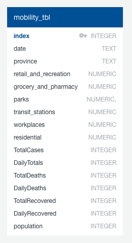

# Capstone Project: Segment 1 Deliverables

## Overview
Our group (Martin Kaminskyj, Sami Elkhayri, Muzznah Ansari, Femi Adeleke, and Patricia Lan) chose to perform data analysis on coronavirus disease of 2019 (COVID-19). The topic of COVID-19 was chosen because it is a current, global issue with extensive socioeconomic impact, and public data is available. Thus, many approaches to analysis are possible. 

This project evaluates government measures to contain the spread of COVID-19, starting from January 1, 2020 to August 31, 2020. The dataset from Oxford university's Blavatnik School of Government contained indices that categorized government responses to COVID-19, Google Community Mobility Reports recorded changes in people's mobility, and Our World in Data provided medical data on COVID-19 (e.g. number of confirmed cases and deaths).

Questions the project hoped to answer were the following: 
1) Are there general correlations between feature vs. target variables?
2) Government measures:
    a) Which measures resulted in desirable outcomes?
    b) Which stringency measures are associated with lower rate of increase of total cases? Total deaths?
3) Can an unsupervised machine learning (unsupML) model group countries by all variables to create meaningful group profiles? (Do group profiles correlate with desirable outcomes?)
4)  High Risk Continent: Which continent pose the most risk to Canada based on age variation, total cases and extreme poverty rating.
5) Supervised machine learning (supML):
    a) Can a model accurately predict future total cases/deaths based on feature variables?
    b) Which feature variables contribute the most to the model?

## Analysis
See "Presentation.pptx" for descriptions of the data exploration and analysis. 

To view the code used to find correlations between feature and target variables, and to create an unsupML model, visit the [analysis_correlations_unsupervisedML directory](analysis_correlations_unsupervisedML). Jupyter notebooks are numbered from 1 to 11, which follows the progression of the analysis. Except for files containing raw data (see "Resources" below), the CSV files in the folder are intermediate files necessary for the progression of the analysis. Image files are byproducts of the notebooks and were used in "Presentation.pptx".

To view the code used to analyse the correlation between the timing and severity of each countries initial stringency efforts and their outcome of total cases and deaths as a percentage of population, visit the [analysis_gov_regulation_impact directory](analysis_gov_regulation_impact).

To view code used to determine the country that pose the most risk based on age variation, total cases and poverty level, visit the [analysis_median_age_per_continent directory](analysis_median_age_per_continent). 

## Database
Data was stored in a SQLite database ([covid_db.db](regulation/Resources/covid_db.db)) to be queried for input into machine learning models. Figure 1 shows an entity relationship diagram (ERD) of the database.

#### Figure 1. Database ERD

## Machine Learning
Sami & Muzznah to revise this section:

Supervised machine learning (supML) models were created to predict target variables (total cases and total deaths) based on feature variables (population density, median age, etc.). At the same time, the models allowed for correlation analysis between feature and target variables. Models included neural network, Support Vector Regression (SVR), and Random Forest Regressor. R-squared values were used to assess for strengths of correlations between feature and target variables. Model accuracy was assessed by comparing R-squared values between training and testing sets. [Click here](regulation/Analysis/FINAL_government_regulation_impact_machine_learning.ipynb) for the programming code for the model.

## Communication Protocols
For effective group communication, protocols included weekly "Zoom" meetings, messaging through Slack, and file-sharing using GitHub and Google Drive. Group members were also assigned project roles and tasks at meetings. Post-meeting, this allowed for members to break off into smaller groups for collaboration. Trello was used to keep track of work in progress and completed tasks. 

## Software
See [Technology.md](Technology.md) for a description of the software used in this project, including software for the dashboard.

## Dashboard
Refer to "Presentation.pptx" for a blueprint of the dashboard's storyboard. 

The dashboard consists of 4 parts which all contain interactive elements. All charts and maps will be interactive as they will be created with plotly and Leaflet.

Part 1 ("The Infection") will contain filters that accept country names as inputs. Line graphs would then display data from those countries. 

Part 2 ("The Response") will contain a dropdown menu that allows the user to select an index (government response, stringency, health, or economic support). The output will be visualization of the top and bottom 5 countries with the highest and lowest indices, respectively, as bar charts. Also, there will be a Leaflet map that visualizes each index as a heatmap (showing the change in a particular index across all countries as a gradient of a colour). Pop-ups with additional info will be attached to each index layer of the map. 

Part 3 ("The Outcomes") will contain a triangular heatmap showing correlations between feature and target variables. There will also be a Leaflet map which visualizes the countries grouped as classes (according to the unsupervised machine learning model). Pop-ups with additional info will be attached to the map. 

Part 4 ("Predictions") will contain a pie chart showing feature importances for the supervised machine learning model. Also, there will be a Leaflet map that visualizes predictions (total cases/deaths) from the model. Predictions will be visualized as circular pop-ups for each country, with the radius and colour of each circle corresponding to the count of total cases/deaths (as a percentage of the population).

## Resources
### Data
- [regional_mobility.csv](analysis_correlations_unsupervisedML/regional_mobility.csv) (Google Community Mobility Reports)
- [owid-covid-data(Aug31,2020).csv](analysis_gov_regulation_impact/Resources/raw/owid-covid-data(Aug31,2020).csv) (Our World in Data - COVID-19 database)
- [OxCGRT_latest(Aug31,2020).csv](analysis_gov_regulation_impact/Resources/raw/OxCGRT_latest(Aug31,2020).csv) (University of Oxford - COVID-19 Government Response Tracker)

### Software
See [Technology.md](Technology.md).

### Other
Presentation.pptx (Detailed information about the project.)